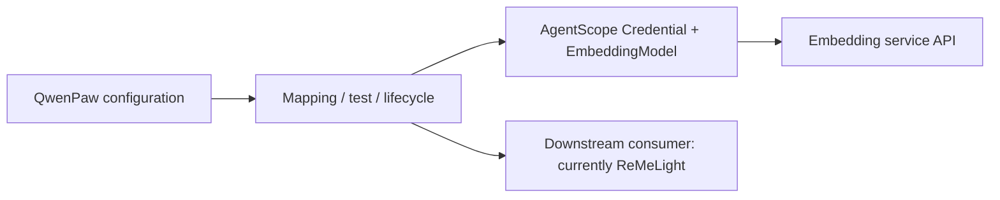
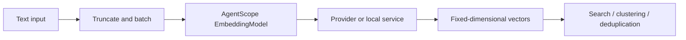

# Embedding Models

Embeddings map text, images, or other inputs to fixed-dimensional numeric vectors. Semantically similar content is closer in vector space, allowing downstream modules to perform semantic search, clustering, deduplication, and similarity checks.

QwenPaw currently provides an **embedding model configuration and runtime layer** based on AgentScope. It covers multiple provider adapters, real-request testing, strict dimension validation, batching and retry mapping, and configuration lifecycle management. ReMeLight is the current direct consumer and uses this layer to add vector support to memory.

---

## Capabilities and Boundaries

| Capability                       | Description                                                                                                    |
| -------------------------------- | -------------------------------------------------------------------------------------------------------------- |
| Multiple providers               | Supports `openai`, `dashscope`, `dashscope_multimodal`, `gemini`, and `ollama`                                 |
| Unified model interface          | Uses AgentScope Credential and EmbeddingModel classes to hide provider SDK differences                         |
| Text embedding                   | Accepts batches of text and returns fixed-dimensional vectors in input order                                   |
| Dimension control and validation | Sends dimension settings according to provider rules and validates the actual output size                      |
| Batching and retries             | QwenPaw sets an upstream batch size; AgentScope splits again for provider limits and retries eligible failures |
| Pre-save test                    | Sends a real request with unsaved settings and reports actual dimensions, latency, and errors                  |
| Configuration lifecycle          | Supports hot updates when possible and invalidates stale cache/index state after vector-space changes          |
| Local cache                      | Lets the current consumer cache identical inputs to reduce repeated computation and API calls                  |

QwenPaw's embedding capability is based on **AgentScope 2.x**. AgentScope supplies provider credentials, embedding models, request assembly, base batching, and retries. QwenPaw supplies configuration mapping, enablement rules, connectivity and response validation, saving, and hot updates.



AgentScope supports more input types than QwenPaw currently exposes:

- `DashScopeEmbeddingModel` routes text and image/video `DataBlock` inputs based on the model name. `GeminiEmbeddingModel` also includes a multimodal path.
- QwenPaw currently sends only text produced by ReMeLight. It does not expose a general embedding API or pass images, audio, video, or PDFs to these models. Selecting a multimodal type or model therefore does not add multimodal file parsing.
- QwenPaw constructs AgentScope models with `parameters=None`. Extra call-level options that AgentScope may accept, such as `task_type` or `text_type`, have no Console or `agent.json` field in the current integration.

---

## Principles

The same model maps documents and queries into one vector space. Systems commonly compare vector direction with cosine similarity: a higher value indicates closer semantics. Embeddings work well for synonyms, natural-language paraphrases, and topical similarity, but do not guarantee exact-token matches for function names or error codes. Retrieval consumers commonly combine them with keyword signals.



A change in model, version, endpoint, output dimensions, or dimension-control behavior can produce a different vector space. Document and query vectors must come from compatible spaces; equal output dimensions alone do not make two models compatible.

### Test, Save, and Apply

The Console's **Test Embedding Service** action sends the current unsaved form values to
`POST /api/workspace/embedding/test`. The backend creates the real model and sends one test string. It requires the
service to:

1. return one non-empty vector within 15 seconds;
2. return only finite numeric values; and
3. return exactly the configured `dimensions`.

On success, the model object is staged for a subsequent save whose service fingerprint still matches the tested values.
That fingerprint contains the backend, API key, normalized Base URL, model name, dimensions, and `use_dimensions`.
QwenPaw first persists the submitted running config, then reuses the staged model for an in-place update when possible.
If the model was not tested, the fingerprint changed after testing, or Embedding components must be added or removed,
QwenPaw recreates the embedded ReMe application. The normal Agent reload is also scheduled after every successful save.

The runtime update is transactional. If both in-place update and ReMe recreation fail, QwenPaw restores the submitted
configuration fields when that can be done without overwriting a concurrent edit, restores the previous runtime when
possible, and returns an error. Embedding changes are rejected while an explicit index rebuild is running.

Changing the backend, normalized Base URL, model name, dimensions, or `use_dimensions` changes the vector-space
fingerprint and sets `needs_reindex=true`; changing only the API key does not. An in-place vector-space change clears
the memory and disk Embedding cache, but deliberately does **not** rebuild the file index. Use **Rebuild Memory Index**
after saving. Until that succeeds, existing same-dimension vectors may still belong to the previous model. A successful
rebuild clears `needs_reindex` only if the persisted and active fingerprints still match the rebuild target.

---

## Configuration

### Configure in the Console

Open **Agent Config → Running Config → Long-term Memory → Embedding Model Config**:

1. Select the Embedding SDK Type.
2. Enter the endpoint, model name, and credentials required by that backend.
3. Enter the model's actual output dimensions.
4. Tune cache, per-input character budget, and batch size for the service limits.
5. Select **Test Embedding Service**. After the actual dimensions and latency are displayed, save the running config.

The Console keeps the connection, model, cache, and batching options in one configuration area so they can be reviewed together before saving:


Testing before saving catches endpoint, credential, model-name, and dimension errors before the configuration enters the running state.

If the form does not meet the enable condition, ReMeLight does not create vector components and memory search continues
to use BM25.

The **Enabled/Disabled** status in the Console overview and the **Embedding Service** card updates in real time from the
current unsaved form. It uses the same configuration enablement rules as the backend and only indicates that the
Backend, model name, and required credentials are complete. It does not make a network request and does not mean the
draft has been saved or applied to the running agent. **Verified** means **Test Embedding Service** completed a real
request with the current service parameters. Runtime state changes only after saving, through either a hot update or an
automatic agent reload.

After a successful request, the service card shows the returned dimensions and latency and marks the current form as **Verified**:


This status covers one real request with the current service parameters. The configuration must still be saved, and a vector-space change still requires an index rebuild.

### Backend Types and Parameters

| QwenPaw type           | AgentScope Credential / Model                     | AgentScope input and model routing                                                                                                                                   | Authentication and endpoint                                                                                                                    | How dimensions are sent                                                                                                     | Enable condition and QwenPaw limit                                                                         |
| ---------------------- | ------------------------------------------------- | -------------------------------------------------------------------------------------------------------------------------------------------------------------------- | ---------------------------------------------------------------------------------------------------------------------------------------------- | --------------------------------------------------------------------------------------------------------------------------- | ---------------------------------------------------------------------------------------------------------- |
| `openai`               | `OpenAICredential` / `OpenAIEmbeddingModel`       | Text; supports `text-embedding-3-small`, `text-embedding-3-large`, and other OpenAI-compatible models                                                                | Required `api_key`; optional `base_url` passed to `openai.AsyncClient`; AgentScope also supports `organization`, which QwenPaw does not expose | Always sends `input`, `model`, and `encoding_format="float"`; sends `dimensions` only when `use_dimensions=true`            | Non-empty `model_name` and `api_key`; the only type that shows `use_dimensions` in the UI                  |
| `dashscope`            | `DashScopeCredential` / `DashScopeEmbeddingModel` | `text-embedding-*` uses the text API; `qwen3-vl-embedding`, `qwen2.5-vl-embedding`, `multimodal-embedding-*`, and `tongyi-embedding-vision-*` use the multimodal API | Required `api_key`; the credential accepts `base_url`, but the current model calls do not use it                                               | Text API always sends `dimension`; multimodal API does not send dimensions, while QwenPaw still validates the response size | Non-empty `model_name` and `api_key`; QwenPaw currently supplies text only                                 |
| `dashscope_multimodal` | Exactly the same as `dashscope`                   | A QwenPaw/ReMe configuration type; AgentScope still selects text or multimodal routing from `model_name`                                                             | Same as `dashscope`                                                                                                                            | Same as `dashscope`                                                                                                         | Non-empty `model_name` and `api_key`; does not make QwenPaw read images or videos automatically            |
| `gemini`               | `GeminiCredential` / `GeminiEmbeddingModel`       | `gemini-embedding-001` uses the text path; `gemini-embedding-2*` uses the multimodal path                                                                            | `api_key` only; neither the AgentScope credential nor QwenPaw exposes Base URL                                                                 | Both paths send `dimensions` as `output_dimensionality`                                                                     | Non-empty `model_name` and `api_key`; QwenPaw currently supplies text only and does not expose `task_type` |
| `ollama`               | `OllamaCredential` / `OllamaEmbeddingModel`       | Text; examples include `nomic-embed-text` and `mxbai-embed-large`                                                                                                    | No API key; maps `base_url` to `host`, with blank selecting Ollama's default host                                                              | Always sends `dimensions`                                                                                                   | Non-empty `model_name`; the QwenPaw process must be able to reach the Ollama host                          |

For every AgentScope model, QwenPaw also sets `context_size=max_input_length` and uses `max_retries=3` during normal
operation. **Test Embedding Service** lowers retries to `1` and adds a 15-second QwenPaw-level timeout.

`max_batch_size` is the upstream batch size used by ReMeLight's `embedding_store`. AgentScope retains its own internal
limits: in the pinned source these are 2048 for OpenAI, 10 for DashScope text, 100 for Gemini text, and 512 for Ollama.
AgentScope splits again and dispatches batches concurrently when needed. The actual usable value still depends on the
specific model and provider limits.

### Fields

The configuration lives at `running.reme_light_memory_config.embedding_model_config` in `agent.json`:

| Field              | Default    | Purpose                                                                                                          |
| ------------------ | ---------- | ---------------------------------------------------------------------------------------------------------------- |
| `backend`          | `"openai"` | SDK type used to invoke the embedding model                                                                      |
| `api_key`          | `""`       | Provider credential; unused by Ollama                                                                            |
| `base_url`         | `""`       | Optional OpenAI API URL; Ollama interprets it as `host`; the current DashScope model calls do not use this value |
| `model_name`       | `""`       | Model name; required by every backend                                                                            |
| `dimensions`       | `1024`     | Expected actual vector size, also used for index and cache compatibility                                         |
| `use_dimensions`   | `false`    | For the `openai` backend only; whether to send `dimensions` in the request                                       |
| `enable_cache`     | `true`     | Whether to cache embedding results locally                                                                       |
| `max_cache_size`   | `10000`    | Maximum local cache entries                                                                                      |
| `max_input_length` | `8192`     | Approximate character budget per input, not an exact token count                                                 |
| `max_batch_size`   | `10`       | Maximum items per batch request                                                                                  |

Example for an OpenAI-compatible service:

```json
{
  "running": {
    "reme_light_memory_config": {
      "embedding_model_config": {
        "backend": "openai",
        "api_key": "your-api-key",
        "base_url": "https://your-embedding-service.example.com/v1",
        "model_name": "your-embedding-model",
        "dimensions": 1024,
        "use_dimensions": false,
        "enable_cache": true,
        "max_cache_size": 10000,
        "max_input_length": 8192,
        "max_batch_size": 10
      }
    }
  }
}
```

If the service rejects a `dimensions` request parameter, keep `use_dimensions: false` but still set `dimensions` to
the model's actual output size.

---

## Pitfalls and Troubleshooting

### Dimensions Are Not an Arbitrary Target

`dimensions` is first and foremost a strict validation value. Unless the model and API explicitly support variable
dimensions, it must equal the model's native output size. A wrong value fails the test with a dimension mismatch;
bypassing the test and saving can also break index construction.

For example, when the configuration expects 256 dimensions but the service returns 1024, the test reports the mismatch instead of accepting an incompatible vector space:


When this appears, verify the model's native dimensions and whether the service supports a dimension parameter rather than bypassing the test.

`use_dimensions` only controls whether the `openai` backend sends that parameter. It does not disable validation. Some
OpenAI-compatible services and vLLM deployments reject the parameter; turn it off and enter the actual output size.

### A Model Change Requires New Vectors

Two models with the same output size can still use incompatible vector spaces. QwenPaw treats backend, normalized
endpoint, model, dimensions, and `use_dimensions` as vector-space identity. It marks the configuration as requiring a
rebuild and, for an in-place update, removes the old `.npz` cache. The index rebuild is explicit rather than automatic:
follow the Console warning and select **Rebuild Memory Index** before relying on vector results. Do not retain or
manually copy an old cache to bypass rebuilding.

Before starting, the Console confirms that rebuilding can temporarily increase CPU and memory usage:


After confirmation, QwenPaw regenerates the derived index from the existing Markdown. Until it finishes, old vectors should not be treated as valid results from the new model.

### Base URL, Host, and SDK Type Are Different Concepts

- OpenAI passes `base_url` to `openai.AsyncClient`.
- `DashScopeCredential` accepts `base_url`, but the AgentScope 2.x `DashScopeEmbeddingModel` used by the current project reads only the API key
  for both its text and multimodal embedding calls; it does not forward that URL to the DashScope SDK. A custom Base URL
  therefore does not change the embedding destination for `dashscope` or `dashscope_multimodal` in the current version.
  Select the `openai` backend when targeting an OpenAI-compatible endpoint.
- Gemini currently ignores `base_url`.
- Ollama interprets the same field as `host`, for example `http://localhost:11434`.
- The SDK type determines request format and credential class, not just the label shown in the UI.

When QwenPaw runs in a container, Ollama at `localhost` refers to that container rather than the host machine. Use an
address reachable from the QwenPaw process.

### Input Length Is a Character Budget, Not a Token Limit

`max_input_length` does not count with the target model's tokenizer. If the service returns HTTP 400 or a context-length
error, especially for long Chinese text, reduce this value. It limits each item; `max_batch_size` limits how many items
are sent together, so the two settings address different constraints.

### Larger Batches and Caches Are Not Always Better

A larger `max_batch_size` can improve throughput but can hit request-size, concurrency, or rate limits. Reduce it first
when a remote service is unstable. A larger cache consumes more memory and disk. Disabling the cache increases repeated
computation and API cost but does not disable the vector index.

### A Successful Test Does Not Mean History Is Fully Indexed

The test validates only one live request, numeric values, and dimensions. First-time enablement and explicit index
rebuilds must still process existing memories and can encounter quotas, rate limits, network errors, or oversized
inputs. After saving, complete any **Rebuild Memory Index** warning, then run a semantic `memory_search` query with
little keyword overlap and confirm that the raw result contains a numeric `vector=...` value.

### Running Without Embeddings Is Valid

When the model name or required credentials are missing, QwenPaw disables vector components and BM25 continues to work.
Paraphrase recall becomes weaker, but exact keywords, function names, and error codes remain searchable.

---

## Current QwenPaw Integration

ReMeLight is currently the only direct consumer of this embedding configuration. It embeds Markdown text under
`memory/` and `digest/` to add a semantic signal to `memory_search` and digest-node similarity queries; BM25 continues
to handle exact keywords.

Embeddings do not expose a standalone agent tool and do not generate memories or answers. Auto Memory Search,
Auto-Dream, and agent context benefit only indirectly through ReMeLight retrieval. When another memory backend such as
ADBPG is selected, that service manages its own vector behavior and is not configured by
`reme_light_memory_config.embedding_model_config`.

---

## Verification

Save a memory such as “My preferred commute is a lightweight bicycle,” then search for “How does the user usually travel
to work?” The two sentences have little keyword overlap. If the memory is recalled and the raw tool output contains a
numeric `vector=...`, the vector branch returned a candidate.

Ask the agent to preserve the raw retrieval fields:

```text
Call memory_search for "How does the user usually travel to work?" Return the raw tool result,
including the score, vector, and keyword fields, without summarizing or rewriting it.
```

- `score`: the RRF-fused score when both paths have candidates; it may be a raw branch score when only one path runs.
- `vector`: raw cosine similarity; a number means a vector hit and `-` means no vector hit.
- `keyword`: raw BM25 score; a number means a keyword hit and `-` means no keyword hit.

If testing fails, check the enable condition, network reachability from the QwenPaw process, model name, exact dimensions,
support for the `dimensions` parameter, input and batch limits, and provider quota or rate limits.

---

## Related Pages

- [Long-term Memory](./memory) — ReMeLight memory files, automatic jobs, and search entry points
- [Memory-Evolving & Proactive Interaction](./memory-evolving-and-proactive) — Auto-Memory, Auto-Dream, Auto-Memory-Search, and Proactive workflows
- [Configuration & Working Directory](./config) — Agent configuration files and workspace layout
