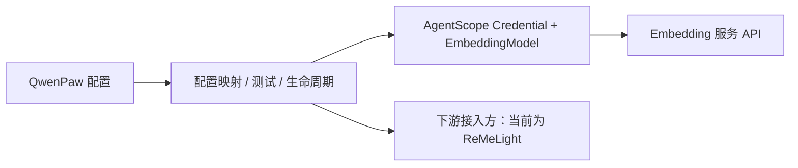
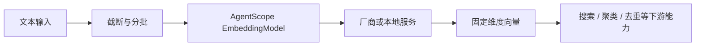

# Embedding 向量模型

Embedding 把文本、图片等输入映射为固定维度的数值向量。语义相近的内容在向量空间中距离更近，因此下游模块可以进行语义搜索、聚类、去重或相似度判断。

QwenPaw 当前提供的是一套基于 AgentScope 的 **Embedding 模型配置与运行能力**，包括多后端适配、真实请求测试、严格维度校验、分批与重试参数映射，以及配置保存后的生命周期管理。当前直接接入方是 ReMeLight：它使用这套能力为记忆提供向量支持。

---

## 能力与边界

| 能力           | 说明                                                                   |
| -------------- | ---------------------------------------------------------------------- |
| 多后端适配     | 支持 `openai`、`dashscope`、`dashscope_multimodal`、`gemini`、`ollama` |
| 统一模型接口   | 通过 AgentScope Credential 和 EmbeddingModel 屏蔽厂商 SDK 差异         |
| 文本向量化     | 接受一批文本并按输入顺序返回固定维度向量                               |
| 维度控制与校验 | 按后端规则发送维度参数，并校验实际返回维度是否与配置一致               |
| 分批与重试     | QwenPaw 设置上游批量大小；AgentScope 再按厂商限制拆批并处理可重试错误  |
| 保存前测试     | 使用未保存配置发送真实请求，返回实际维度、延迟和错误原因               |
| 配置生命周期   | 支持满足条件时热更新；向量空间变化时使旧缓存和索引失效                 |
| 本地缓存       | 让当前接入方缓存相同输入的向量，降低重复计算和 API 调用                |

QwenPaw 的 Embedding 能力基于 **AgentScope 2.x**。厂商 Credential、EmbeddingModel、请求组装、基础拆批和重试来自 AgentScope；QwenPaw 负责配置映射、启用判断、连通性与返回值测试、保存和热更新。



AgentScope 的能力范围比 QwenPaw 当前开放的输入范围更广：

- `DashScopeEmbeddingModel` 能根据模型名处理文本或图片/视频 `DataBlock`；`GeminiEmbeddingModel` 也包含多模态模型路径。
- QwenPaw 当前只把 ReMeLight 产生的文本交给模型，没有通用 Embedding API，也没有把图片、音频、视频或 PDF 传入模型。因此选择多模态类型或模型不会自动获得多模态文件解析能力。
- QwenPaw 构造 AgentScope 模型时传入 `parameters=None`。AgentScope 调用层可能接受的 `task_type`、`text_type` 等扩展参数，目前没有对应的控制台或 `agent.json` 配置项。

---

## 原理

同一个模型把文档和查询映射到同一向量空间。系统通常使用余弦相似度比较方向：值越高，代表语义越接近。Embedding 擅长同义表达、自然语言改写和主题相关性，但不擅长保证函数名、错误码等精确 token 一定命中；下游检索模块通常会把它与关键词信号组合。



模型、版本、服务地址、输出维度或维度控制方式变化，都可能产生不同的向量空间。文档向量和查询向量必须来自兼容空间；即使两个模型输出维度相同，也不能假定它们可以混用。

### 测试、保存与生效

控制台的“测试 Embedding 服务”会把当前尚未保存的表单配置发送到
`POST /api/workspace/embedding/test`。后端会创建实际模型并发送一条测试文本，要求服务：

1. 在 15 秒内返回一条非空向量；
2. 向量中所有值都是有限数值；
3. 实际维度与 `dimensions` 完全一致。

测试成功的模型对象会暂存，供之后服务指纹仍与测试值一致的保存复用。该指纹包含后端、API Key、规范化后的 Base URL、
模型名称、维度和 `use_dimensions`。QwenPaw 会先持久化提交的运行配置，再尽可能复用已测试模型进行原位更新。
如果未测试、测试后服务指纹发生变化，或需要新增、移除 Embedding 组件，则会重新创建内嵌 ReMe。每次成功保存后仍会调度
正常的 Agent 自动重载。

运行时更新采用事务式流程。如果原位更新和 ReMe 重建都失败，QwenPaw 会在不覆盖并发修改的前提下恢复本次提交的配置字段，
尽可能恢复旧 runtime，并返回错误。显式重建索引期间不允许修改 Embedding。

修改后端、规范化后的 Base URL、模型名称、维度或 `use_dimensions` 会改变向量空间指纹并设置
`needs_reindex=true`；只修改 API Key 不会。向量空间原位更新会清除内存和磁盘 Embedding 缓存，
但刻意**不会**自动重建文件索引。保存后必须执行“重建记忆索引”；在成功重建前，已有的同维度向量仍可能来自旧模型。
只有当持久化配置和当前运行配置仍与本次重建目标一致时，成功重建才会清除 `needs_reindex`。

---

## 如何配置

### 在控制台中配置

进入 **Agent 配置 → 运行配置 → 长期记忆 → 向量模型配置**：

1. 选择“向量模型 SDK 类型”。
2. 填写该后端要求的地址、模型名称和凭证。
3. 填写模型实际输出的向量维度。
4. 按服务限制调整缓存、单条输入字符预算和批处理大小。
5. 点击“测试 Embedding 服务”。确认显示实际维度和耗时后，再保存运行配置。

控制台会把服务连接、模型参数、缓存和批处理选项集中在同一个配置区域，便于在保存前一次性核对：


完成填写后，先测试再保存，可以在配置真正进入运行状态前发现地址、凭证、模型名称或维度错误。

只填表单但不满足启用条件时，ReMeLight 不会创建向量组件，记忆搜索会继续使用 BM25。

控制台顶部和“Embedding 服务”卡片中的“已开启/未开启”会根据当前未保存表单实时更新。该状态复用后端的配置启用规则，
只表示 Backend、模型名称和必要凭证是否完整，不会发起网络请求，也不代表草稿已经保存或运行中的 Agent 已经应用该配置。
“已验证”表示“测试 Embedding 服务”已经使用当前服务参数完成一次真实请求；保存后，配置才会通过热更新或自动重载应用到运行状态。

测试成功后，服务卡片会显示实际返回维度和请求耗时，并把当前表单标记为“已验证”：


这个状态只对应当前服务参数的一次真实请求，仍需保存配置，并在向量空间发生变化时完成索引重建。

### 后端类型与参数总表

| QwenPaw 类型           | AgentScope Credential / Model                     | AgentScope 输入与模型路由                                                                                                                       | 认证和地址参数                                                                                                  | 维度如何传给服务                                                                                     | 启用条件与 QwenPaw 限制                                                    |
| ---------------------- | ------------------------------------------------- | ----------------------------------------------------------------------------------------------------------------------------------------------- | --------------------------------------------------------------------------------------------------------------- | ---------------------------------------------------------------------------------------------------- | -------------------------------------------------------------------------- |
| `openai`               | `OpenAICredential` / `OpenAIEmbeddingModel`       | 文本；支持 `text-embedding-3-small`、`text-embedding-3-large` 等 OpenAI 兼容模型                                                                | `api_key` 必填；`base_url` 可选并传给 `openai.AsyncClient`；AgentScope 还支持 `organization`，但 QwenPaw 未开放 | 请求总是传 `input`、`model`、`encoding_format="float"`；仅当 `use_dimensions=true` 时传 `dimensions` | `model_name`、`api_key` 非空；只有此类型在前端显示 `use_dimensions`        |
| `dashscope`            | `DashScopeCredential` / `DashScopeEmbeddingModel` | `text-embedding-*` 走文本 API；`qwen3-vl-embedding`、`qwen2.5-vl-embedding`、`multimodal-embedding-*`、`tongyi-embedding-vision-*` 走多模态 API | `api_key` 必填；Credential 接收 `base_url`，但当前模型调用未使用它                                              | 文本 API 始终传 `dimension`；多模态 API 不传维度，QwenPaw 仍校验返回维度                             | `model_name`、`api_key` 非空；QwenPaw 当前只输入文本                       |
| `dashscope_multimodal` | 与 `dashscope` 完全相同                           | 这是 QwenPaw/ReMe 配置类型；AgentScope 仍由 `model_name` 决定文本或多模态路由                                                                   | 与 `dashscope` 相同                                                                                             | 与 `dashscope` 相同                                                                                  | `model_name`、`api_key` 非空；不会让 QwenPaw 自动读取图片或视频            |
| `gemini`               | `GeminiCredential` / `GeminiEmbeddingModel`       | `gemini-embedding-001` 为文本路径；`gemini-embedding-2*` 为多模态路径                                                                           | 仅 `api_key`；AgentScope Credential 和 QwenPaw 都不提供 Base URL                                                | 文本和多模态路径都以 `output_dimensionality` 传入 `dimensions`                                       | `model_name`、`api_key` 非空；QwenPaw 当前只输入文本，且未开放 `task_type` |
| `ollama`               | `OllamaCredential` / `OllamaEmbeddingModel`       | 文本；例如 `nomic-embed-text`、`mxbai-embed-large`                                                                                              | 不需要 API Key；`base_url` 映射为 `host`，留空使用 Ollama 默认 Host                                             | 始终传 `dimensions`                                                                                  | `model_name` 非空；QwenPaw 进程必须能访问 Ollama Host                      |

QwenPaw 还向所有 AgentScope 模型传入 `context_size=max_input_length`、正常运行时 `max_retries=3`；
“测试 Embedding 服务”会把重试次数降为 `1`，并在 QwenPaw 外层增加 15 秒超时。

`max_batch_size` 是 ReMeLight `embedding_store` 的上游分批大小。AgentScope 模型内部仍有自己的批量上限：
当前源码中 OpenAI 为 2048、DashScope 文本为 10、Gemini 文本为 100、Ollama 为 512；超出时 AgentScope
还会再次拆分并并发请求。实际可用值仍受具体模型和服务端限制。

### 配置字段

配置位于 `agent.json` 的 `running.reme_light_memory_config.embedding_model_config`：

| 字段               | 默认值     | 作用                                                                              |
| ------------------ | ---------- | --------------------------------------------------------------------------------- |
| `backend`          | `"openai"` | 调用 Embedding 模型使用的 SDK 类型                                                |
| `api_key`          | `""`       | 服务凭证；Ollama 不使用                                                           |
| `base_url`         | `""`       | OpenAI 的可选 API 地址；Ollama 中作为 `host`；当前 DashScope 模型调用不会使用该值 |
| `model_name`       | `""`       | 模型名称；所有后端都必填                                                          |
| `dimensions`       | `1024`     | 预期实际输出维度，也用于索引和缓存兼容性判断                                      |
| `use_dimensions`   | `false`    | 仅对 `openai` 后端生效；是否在请求中发送 `dimensions` 参数                        |
| `enable_cache`     | `true`     | 是否启用本地 Embedding 结果缓存                                                   |
| `max_cache_size`   | `10000`    | 本地缓存最大条目数                                                                |
| `max_input_length` | `8192`     | 单条输入的近似字符预算，不是精确 token 数                                         |
| `max_batch_size`   | `10`       | 单次批量请求的最大条目数                                                          |

示例（OpenAI 兼容服务）：

```json
{
  "running": {
    "reme_light_memory_config": {
      "embedding_model_config": {
        "backend": "openai",
        "api_key": "your-api-key",
        "base_url": "https://your-embedding-service.example.com/v1",
        "model_name": "your-embedding-model",
        "dimensions": 1024,
        "use_dimensions": false,
        "enable_cache": true,
        "max_cache_size": 10000,
        "max_input_length": 8192,
        "max_batch_size": 10
      }
    }
  }
}
```

如果服务不支持请求中的 `dimensions` 参数，请保持 `use_dimensions: false`，但仍要把 `dimensions` 设置为模型的实际输出维度。

---

## 常见坑与排查

### 维度不是“想要多少就填多少”

`dimensions` 首先是严格校验值。除非模型和接口明确支持可变维度，否则它必须等于模型原生输出维度。
填错会在测试阶段直接得到 dimension mismatch；绕过测试保存也可能使索引构建失败。

例如，配置期望 256 维而服务实际返回 1024 维时，测试会直接给出维度不匹配，而不是接受一个不兼容的向量空间：


看到这类提示时，应核对模型原生维度以及服务是否支持维度参数，不应通过跳过测试来继续使用。

`use_dimensions` 只决定 `openai` 后端是否把该参数发给服务，并不会关闭维度校验。部分 OpenAI 兼容服务和
vLLM 部署不接受该参数，此时应关闭开关并填写实际维度。

### 更换模型后必须重建向量

不同模型即使输出维度相同，也不是同一个向量空间，旧向量不能与新查询向量混用。QwenPaw 会根据后端、规范化后的地址、
模型、维度和 `use_dimensions` 判断向量空间是否变化，标记需要重建，并在原位更新时删除旧 `.npz` 缓存。
索引重建是显式操作，不会自动执行：看到 Console 警告后应先选择“重建记忆索引”，再依赖向量结果。
不要保留或手工复制旧缓存来规避重建。

控制台会在执行前再次提示重建期间可能增加 CPU 和内存占用：


确认重建后，系统会从现有 Markdown 重新生成派生索引；完成之前，不应把旧向量结果视为新模型的有效结果。

### Base URL、Host 和 SDK 类型容易混淆

- OpenAI 的 `base_url` 会传给 `openai.AsyncClient`。
- DashScope Credential 接收 `base_url`，但当前项目所用的 AgentScope 2.x `DashScopeEmbeddingModel` 在文本和多模态
  Embedding 调用中都只读取 API Key，没有把该地址传给 DashScope SDK。因此当前选择 `dashscope` 或
  `dashscope_multimodal` 时，自定义 Base URL 不会改变 Embedding 请求目的地；如需调用 OpenAI 兼容地址，
  应选择 `openai` 后端。
- Gemini 当前不读取 `base_url`。
- Ollama 把同一字段解释为 `host`，例如 `http://localhost:11434`。
- “OpenAI 兼容接口”应选择其真正兼容的 SDK 类型；SDK 类型决定请求格式和凭证对象，不只是界面标签。

如果 QwenPaw 运行在容器中，Ollama 的 `localhost` 指向容器自身，通常不是宿主机。应填写从 QwenPaw 进程所在网络可达的地址。

### 输入长度是字符预算，不是 token 上限

`max_input_length` 不会使用目标模型 tokenizer 精确计数。遇到 HTTP 400、context length exceeded，尤其是中文长文本时，
继续调低该值。它控制单条输入；`max_batch_size` 控制一批多少条，两者解决的是不同限制。

### 批量和缓存并非越大越好

较大的 `max_batch_size` 能提高吞吐，但更容易触发请求体大小、并发或速率限制；远程服务不稳定时应先减小。
较大的 `max_cache_size` 会占用更多内存和磁盘；关闭缓存会增加重复计算和 API 成本，但不会关闭向量索引。

### “测试成功”不代表所有历史数据已完成索引

测试只验证单条实时请求、数值合法性和维度。首次启用或显式重建索引还要处理现有记忆，可能受到速率限制、配额、网络波动或超长输入影响。
保存后应先处理“重建记忆索引”警告，再用 `memory_search` 做一次无明显关键词重合的语义查询，确认结果中出现数值形式的 `vector=...`。

### 没配置 Embedding 不是故障

模型名或必要凭证为空时，向量组件会被禁用，BM25 关键词索引仍然工作。此时自然语言改写的召回会变弱，但精确关键词、函数名和错误码仍可检索。

---

## 在 QwenPaw 中的当前接入

当前只有 ReMeLight 直接消费这套 Embedding 配置。它把 `memory/`、`digest/` 中的 Markdown 文本向量化，
为 `memory_search` 和 digest 节点相似度查询补充语义信号；精确关键词仍由 BM25 负责。

Embedding 没有独立的 Agent 工具，也不会生成记忆或答案。Auto Memory Search、Auto-Dream 和 Agent 上下文只是通过
ReMeLight 的检索结果间接受益。选择 ADBPG 等其他记忆后端时，向量能力由对应服务管理，
`reme_light_memory_config.embedding_model_config` 不会配置这些后端。

---

## 验证建议

先保存一条记忆：“我首选的通勤工具是一辆轻便自行车。”，再搜索“用户平时怎样去上班？”。两句话没有明显关键词重合，
如果结果中出现该记忆且工具原始输出包含 `vector=<数值>`，说明向量分支实际返回了候选。

可以要求 Agent 保留原始检索字段：

```text
请调用 memory_search 工具搜索“用户平时怎样去上班？”。请原样返回工具结果，
包括 score、vector、keyword 字段，不要总结或改写。
```

- `score`：两路都有候选时为 RRF 融合分数；只有一路工作时可能是该分支的原始分数。
- `vector`：原始余弦相似度；数值表示向量分支命中，`-` 表示未命中。
- `keyword`：原始 BM25 分数；数值表示关键词分支命中，`-` 表示未命中。

如果测试失败，依次检查：启用条件是否满足、QwenPaw 进程能否访问服务、模型名称是否存在、维度是否准确、
服务是否接受 `dimensions` 参数、输入与批量限制是否过大，以及 API 配额或速率限制。

---

## 相关页面

- [长期记忆](./memory) — ReMeLight 的记忆文件、自动任务与搜索入口
- [智能体记忆进化与主动交互](./memory-evolving-and-proactive) — Auto-Memory、Auto-Dream、Auto-Memory-Search 与 Proactive 工作流
- [配置与工作目录](./config) — Agent 配置文件与工作区结构
