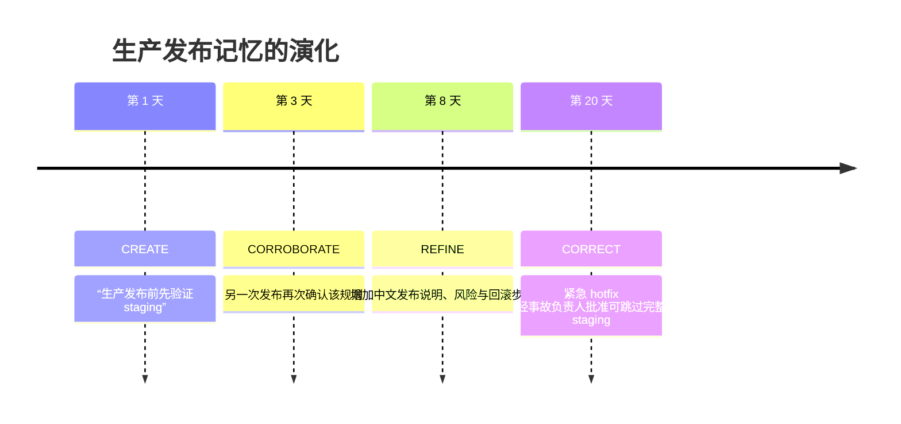

# 记忆自进化与主动交互（Beta）

> 本文只回答两个问题：**记忆如何随时间自我改进**，以及 **NousAIPaw 如何在用户再次提问前主动行动**。记忆目录、配置、采集和检索等基础内容请参见[长期记忆](./memory)。

NousAIPaw 不把记忆当成不断增长的聊天记录。近期事件作为证据保留，Auto-Dream 则持续把证据转化为可复用知识：查找已有观点，判断新证据会如何改变它，更新内容，并保留通往来源的链接。主动交互更进一步——根据当前活动识别有价值的下一步，在合适的时机主动提供帮助。

## 全景图

记忆系统先把对话与资源保存为证据，再把其中可复用的知识沉淀到长期节点，最后通过搜索或主动发现影响后续行为：


其中有两个关键闭环：

- **进化闭环**从每日证据流向稳定的 `digest/` 知识，再通过检索回到后续对话。
- **主动闭环**等待合适的时机，推断接下来可能有帮助的事项，提前完成准备工作，并发起新交互。

两者在理念上相关，但当前实现尚未完全打通。尤其要注意：QwenPaw 的 `/proactive` 命令读取近期 session 和可选屏幕上下文；它目前**不会**直接读取 Auto-Dream 生成的 `interests.yaml` 或 `digest/`。

## “自进化”究竟是什么

静态记忆系统只能追加和检索；自进化记忆还需要判断：新证据对已有知识意味着什么。

Auto-Dream 处理发生变化的每日记忆，把每个可复用单元与已有 `digest/` 节点比较，再执行四种语义更新之一：

| 动作          | 对知识库的影响                           | 典型信号                       |
| ------------- | ---------------------------------------- | ------------------------------ |
| `CREATE`      | 没有等价观点时创建长期节点               | 新偏好、新流程、新事实或新原则 |
| `CORROBORATE` | 保留已有结论并增加支持证据               | 相同偏好或做法再次出现         |
| `REFINE`      | 补充范围、步骤、条件或例外，使节点更准确 | 后续对话补齐了细节             |
| `CORRECT`     | 修改过期或冲突的结论，同时保留来源       | 用户改变决定或纠正了旧事实     |

因此，`digest/` 是一份持续维护的“用户与工作模型”，而不是摘要堆积。每日记忆保留历史现场，长期节点则可以变得更可信、更具体或更准确。

从每日证据到长期知识图谱的整理过程可以概括为“提取、判断、整合、连边”：


图中的 `CONFIRM` 是对“增加支持证据”的视觉化简称；在当前接口和本文术语中，对应的正式动作名称是 `CORROBORATE`。

### 链接为什么重要

每次进化也会加强知识周围的关系图：

- **来源链接**把结论连接到支持或改变它的每日记忆；
- **关系链接**把应当一起召回的偏好、流程、项目和概念连接起来；
- 更新节点时保留已有链接，因此纠错不会抹掉历史。

最终结果既可用，也可审计：检索可以从一个命中节点展开相关上下文，人也可以沿链接回到原始证据。

## 示例：发布流程如何越用越准确

假设团队在不同日期多次讨论发布。Auto-Memory 把每次对话记为每日证据，Auto-Dream 则持续演化同一个长期流程，而不是创建四份近似摘要。



第 1 天后，Auto-Dream 可能创建：

```markdown
---
name: 生产发布流程
description: 每次生产发布前都要先验证 staging。
---

# 生产发布

1. 在 staging 验证版本。
2. 验证通过后才能进入生产环境。

## Sources

- [[memory/2026-08-01/release-planning.md]]
```

到第 20 天，同一个节点可能已经演化为：

```markdown
---
name: 生产发布流程
description: 常规发布必须验证 staging；紧急 hotfix 使用经批准的例外流程。
---

# 生产发布

## 常规流程

1. 在 staging 验证版本。
2. 使用中文编写发布说明，并列出风险和回滚步骤。
3. 验证通过后才能进入生产环境。

## 紧急 hotfix 例外

只有取得事故负责人批准后，才可以跳过完整 staging。必须记录原因，并在事后补做省略的检查。

relates_to:: [[digest/personal/release-communication-preference.md]]
depends_on:: [[digest/procedure/rollback-verification.md]]

## Sources

- [[memory/2026-08-01/release-planning.md]]
- [[memory/2026-08-03/release-review.md]]
- [[memory/2026-08-08/release-notes.md]]
- [[memory/2026-08-20/hotfix-retrospective.md]]
```

真正重要的不是文字变多，而是判断不断累积：

1. 重复出现的信息会增强可信度，不会制造重复节点；
2. 新细节会被组织成可执行流程；
3. 表面上的冲突会变成有适用范围的例外，而不是悄悄覆盖旧规则；
4. 来源和关系链接让最终流程既可解释，也更容易召回。

以后再处理发布任务时，`memory_search` 可以召回这个流程并沿链接展开，让 Agent 同时获得沟通偏好与回滚验证上下文。

## 从记忆进化到兴趣主题

在同一次 Auto-Dream 中，近期证据还可以生成少量、避免重复的兴趣主题，写入 `memory/<date>/interests.yaml`。每个主题包含标题、原因、证据、关键词和相关路径。延续发布案例，其中一个主题可能是：

```yaml
- title: 验证紧急回滚流程
  reason: 已增加 hotfix 例外，但尚未记录事后补做的检查。
  evidence:
    - hotfix 复盘中讨论了跳过 staging 的情况。
  keywords: [hotfix, rollback, release]
  paths:
    - memory/2026-08-20/hotfix-retrospective.md
```

ReMe 提供了一个底层 `proactive` job，用来读取这个文件并返回其元数据，也可以返回原始内容。这样，其他集成可以消费兴趣主题；如果文件不存在，该 job 会正常返回 skipped 结果。

Auto-Dream 完成后，扫描范围、整合结果和兴趣主题会以摘要形式进入 Inbox：


这类通知帮助用户快速了解本轮变化；主题原文和长期节点仍分别保存在 `interests.yaml` 与 `digest/` 中。

## QwenPaw 的主动交互

面向用户的主动模式是在内存中按当前 Agent 名称保存的监控任务：

```text
/proactive           # 开启；空闲 30 分钟后触发
/proactive on        # 同上
/proactive 45        # 使用 45 分钟空闲阈值
/proactive off       # 停止主动监控
```

开启后，主动模式会从近期信号推断可能有帮助的下一步，并在采取进一步行动前把建议交给用户：


这是一张产品理念图：它说明证据积累、兴趣发现和有用下一步之间的关系。当前 `/proactive` 的实际触发依据仍是近期聊天活动和可选屏幕上下文，而不是直接读取图中的整个个人知识库。

监控器每 30 秒检查一次。空闲时钟取当前 workspace 所有聊天中最新的 `updated_at`，并不只看执行
`/proactive` 的那条聊天。达到设定阈值后，它读取最近 7 天更新过的 sessions；如果不足 5 个，则回退到
最新的 5 个 sessions。上下文最多包含 100 条近期非 system 文本消息，总长度不超过 50,000 字符。
当前模型支持多模态输入时，还可能截取并分析桌面画面。

监控配置和任务只存在于进程内存，不会跨进程重启持久化。再次执行 `/proactive` 或 `/proactive on`
会用默认 30 分钟阈值替换当前 Agent 的内存配置；`/proactive <正整数>` 会替换为指定阈值。

Proactive assistant 会推断 1–3 个可能目标，为最多 3 个候选目标尝试具体查询，并在首次成功后停止。如果执行期间用户重新活跃，本次任务会被中断；如果上一条 `[PROACTIVE]` 消息尚未得到回应，也不会继续发送新的主动消息。

### 主动消息示例

假设近期聊天显示生产发布即将开始，并且团队反复讨论回滚风险。达到空闲阈值后，Proactive assistant 可能先检查仓库里的当前回滚清单，再发送：

```text
[PROACTIVE] 我注意到生产发布临近。当前清单已经覆盖 staging 验证和回滚负责人，
但还缺少复盘中提到的 hotfix 事后验证步骤。需要我把这一步补进发布清单吗？
```

这个例子准确体现了当前边界：触发和任务推断来自近期聊天活动（也可能包括屏幕），即使 Auto-Dream 独立生成了相似的兴趣主题，两条路径目前也没有直接连接。

### 隐私与安全边界

主动模式可以读取历史聊天上下文；多模态分析可用时，可能截取桌面画面；它还会初始化一个带有网页搜索/抓取、
浏览器、文件读取、Shell 和可选截图工具的独立 assistant。这个 assistant 使用 bypass 权限运行。
`/proactive` 命令会明确警告这条边界；请只在这些访问权限合适时开启，并使用 `/proactive off`
停止内存中的监控任务。

简而言之：Auto-Dream 让记忆随时间变得更好，`memory_search` 让后续对话从这种进化中获益，而 `/proactive` 则判断何时值得在下一次请求到来前先做一些有用的工作。
