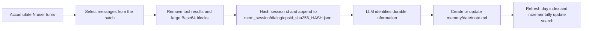
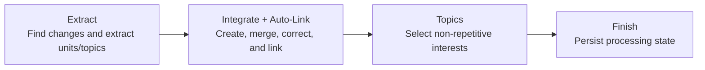
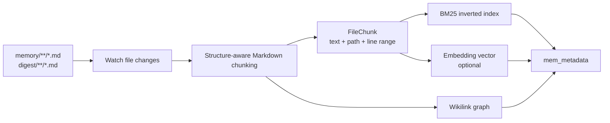

# Long-Term Memory

NousAIPaw's long-term memory is powered by [ReMe](https://github.com/agentscope-ai/ReMe). Instead of putting the entire conversation history back into context, it continuously turns conversations and Daily Paper readings into **readable, editable, searchable, and interconnected Markdown memories**. Over time, those files become a self-evolving personal knowledge base maintained jointly by the user and the Agent.

The default `remelight` backend embeds ReMe in the NousAIPaw process and reuses the current Agent's model for memory extraction and consolidation. The system follows a capture, consolidation, retrieval, and discovery loop:


Conversations and external resources first become traceable daily memory, which Auto-Dream consolidates into `digest/`. Indexing and search retrieve only the relevant passages instead of reloading the entire history.

The framework has four core capabilities:

| Capability         | Purpose                                                                                                                     |
| ------------------ | --------------------------------------------------------------------------------------------------------------------------- |
| **Memory as File** | Stores memory as Markdown with frontmatter and `[[wikilinks]]`; these user-owned files are the source of truth              |
| **Auto-Memory**    | Extracts durable facts, preferences, decisions, and progress from conversations into daily memory                           |
| **Daily Paper**    | Selects papers, stores their PDFs, and writes detailed readings plus a daily brief into daily memory                        |
| **Auto-Dream**     | Distills stable knowledge from recent daily memory, merges or corrects long-term nodes, and creates links through Auto-Link |
| **Memory Search**  | Retrieves chunks with BM25 and optional vector search, fuses rankings with RRF, then expands Wikilink context               |

Auto-Memory is the prerequisite for building the knowledge base: it first turns conversations into reliable material. Auto-Dream is the key to its evolution: it consolidates scattered material into stable, connected long-term knowledge.

The Console brings these capabilities together on the long-term memory page:


Memory capture, scheduled organization, Daily Paper, search, and maintenance status are shown in one place; the sections below explain how each area behaves at runtime.

---

## Memory as File

ReMe follows the principle **Memory as File, File as Memory**:

- For users, memories are ordinary workspace files that can be read, edited, moved, deleted, backed up, and migrated directly.
- For Agents, each Markdown file is also a memory node that can be chunked, indexed, linked, and evolved.
- Search indexes, graphs, and caches are derived state that can be rebuilt from the source files; users retain control of the actual memory.

The following view condenses that model into a readable, editable, traceable, and connected Markdown network:


The body carries knowledge, frontmatter provides a summary, and Wikilinks connect durable nodes with their workflows and daily evidence.

### File Structure

By default, each Agent workspace is located at `~/.qwenpaw/workspaces/{agent_id}/` and uses this memory layout:

```text
{workspace}/
├── memory/                              # Daily memory: conversation facts and paper readings
│   ├── 2026-08-06.md                    # Index page for the day
│   └── 2026-08-06/
│       ├── project-plan.md              # Memory card created or updated by Auto-Memory
│       ├── paper-reading.md             # Detailed reading produced by Daily Paper
│       └── interests.yaml               # Interest topics produced by Auto-Dream
├── mem_session/
│   └── dialog/
│       └── qpsid_sha256_<64-hex>.jsonl  # Hashed source conversation for Auto-Memory
├── digest/                              # Long-term personal knowledge base
│   ├── personal/                        # User, team, and project facts and preferences
│   ├── procedure/                       # Processes, runbooks, and reusable experience
│   └── wiki/                            # Concepts, principles, observations, and decision precedents
├── resource/                            # Raw assets produced by knowledge workflows
│   └── papers/
│       └── <arxiv_id>.pdf               # PDF downloaded by Daily Paper
└── mem_metadata/                        # Derived indexes, graph, catalogs, and caches
```

The four user-visible directories have distinct responsibilities:

| Directory                    | Content                                                                      | Directly indexed by NousAIPaw memory search |
| ---------------------------- | ---------------------------------------------------------------------------- | ------------------------------------------- |
| `memory/YYYY-MM-DD/*.md`     | Daily facts, conversation summaries, decisions, progress, and paper readings | Yes                                         |
| `mem_session/dialog/*.jsonl` | Sanitized source conversations for traceability and later extraction         | No                                          |
| `digest/`                    | The long-term personal knowledge base consolidated by Auto-Dream             | Yes                                         |
| `resource/`                  | Raw assets produced by Daily Paper and future knowledge workflows            | No                                          |

> NousAIPaw's embedded ReMe indexes only `.md` files under `memory/` and `digest/`. Raw conversations are queried by the context system. Daily Paper writes searchable Markdown readings under `memory/`; arbitrary files under `resource/` are not watched.

### Markdown, Frontmatter, and Wikilinks

A memory typically combines YAML frontmatter, body text, and Wikilinks:

```markdown
---
name: User's release workflow preference
description: The user wants staging validation before every production release.
source_conversation: "[[mem_session/dialog/qpsid_sha256_<64-hex>.jsonl]]"
---

# Release preference

Every production release must first run [[digest/procedure/staging-verification.md]].

## Sources

- [[memory/2026-08-06/release-discussion.md]]
```

Frontmatter provides a node-level summary and source metadata. The body stores facts, conditions, and explanations. `[[...]]` uses workspace-relative paths to create file relationships. After search hits a file, ReMe can expand its incoming and outgoing links from the graph index, giving the Agent related long-term nodes and sources together with the matching text.

---

## Auto-Memory: Turning Conversations into Daily Memory

Auto-Memory is the entry point to the personal knowledge base. It does not preserve a chat transcript as a summary. It extracts information that may still be useful later, including:

- stable preferences and long-term agreements;
- project context, important facts, and constraints;
- confirmed decisions and their rationale;
- current progress, blockers, and next steps;
- reusable commands, procedures, and troubleshooting experience.

### How It Works



By default, NousAIPaw triggers Auto-Memory after every five user turns. Before calling ReMe, NousAIPaw converts the exact
session ID bytes to `qpsid_sha256_<64-hex>` so the filename is fixed-length and remains distinct across
case-insensitive and Unicode-normalizing filesystems. ReMe saves the source conversation under that identifier, then
looks for an existing note for the hashed session and date. It updates the existing card when one exists and creates at
most one new card otherwise. Automatically recalled memory is removed before extraction so old search results cannot be
mistaken for facts newly supplied by the user.

The hash mapping is one-way and legacy unhashed dialog files are not migrated. After an upgrade, an existing session
starts a new hashed dialog; previously extracted Markdown memory remains available.

When context is actually evicted or folded, pending turns are flushed through the same Auto-Memory pipeline even if the normal interval has not yet been reached. Searched-turn and pending-turn state is retained across middleware rebuilds and restored sessions. Automatically recalled results are injected only into model input for the active user turn and are not written to formal or persisted conversation history.

### Configuration

Configure Auto-Memory under `running.reme_light_memory_config` in `agent.json`:

```json
{
  "running": {
    "memory_manager_backend": "remelight",
    "reme_light_memory_config": {
      "auto_memory_interval": 5,
      "auto_memory_inbox_push_enabled": true
    }
  }
}
```

| Field                            | Default | Description                                                                     |
| -------------------------------- | ------- | ------------------------------------------------------------------------------- |
| `auto_memory_interval`           | `5`     | Trigger after every N user turns; `null` or `<= 0` disables periodic triggering |
| `auto_memory_inbox_push_enabled` | `true`  | Push the job result to Inbox when Auto-Memory actually changes memory           |

A smaller interval updates memory sooner, but increases model calls, token usage, and background work.

### Inbox

When `auto_memory_inbox_push_enabled` is on, Auto-Memory results appear in NousAIPaw's Inbox. If the run finds nothing worth creating or updating, ReMe reports `modified=false` and NousAIPaw does not create an Inbox event for that no-op.

When a run makes a real change, Inbox shows its status, updated files, and extracted result so the user can quickly see what Auto-Memory did:


Inbox is only the notification surface. The reusable, editable memory remains the Markdown stored in the workspace.

### Example

Suppose the user says in a NousAIPaw session:

```text
For every production release, validate staging first. Write the release notes in Chinese and include risks and rollback steps.
```

After the configured interval, Auto-Memory preserves the source and creates or updates files such as:

```text
mem_session/dialog/qpsid_sha256_<64-hex>.jsonl
memory/2026-08-06/release-discussion.md
```

```markdown
---
name: Production release agreement
description: Validate staging first; Chinese release notes must include risks and rollback steps.
source_conversation: "[[mem_session/dialog/qpsid_sha256_<64-hex>.jsonl]]"
---

- Complete staging validation before a production release.
- Write release notes in Chinese and include risks and rollback steps.
```

This is still daily material. When the same preference appears in more conversations, Auto-Dream can consolidate it into a stable `digest/` node.

---

## Daily Paper

Daily Paper collects Hugging Face weekly and monthly rankings, excludes yesterday's list and arXiv IDs found in the
previous 30 days of daily-note frontmatter, and applies weighted RRF to build a pool of at most 20 candidates. The memory
Agent must select exactly three unique in-pool papers. ReMe downloads their PDFs, analyzes up to 20 pages and 300,000
characters per PDF (maximum file size 50 MiB), and produces three detailed readings plus a daily brief. PDFs are stored
under `resource/papers/`; Markdown is written under `memory/YYYY-MM-DD/`, enters the normal memory index, and can be
delivered through NousAIPaw's Inbox.

The Console exposes Daily Paper scheduling, topic, mirror, and completion-notification settings together:


These options control automatic execution only. Generated PDFs, readings, and the daily brief still enter the `resource/` and `memory/` directories described above.

If a daily brief already exists for the run date, the normal scheduled call reports a successful skip. The underlying
job accepts `force=true` for callers that intentionally regenerate it; this switch is not exposed by the scheduled
configuration form.

Daily Paper is disabled by default. Enable it with `daily_paper_cron_enabled`; `daily_paper_cron` controls the schedule and defaults to `"0 9 * * *"`. `daily_paper_use_hf_mirror` selects the Hugging Face mirror, and `daily_paper_topics` supplies preferred topics.

---

## Auto-Dream: Evolving the Personal Knowledge Base

Auto-Dream consolidates daily memory into long-term knowledge. It normally runs on a schedule, scans recently changed daily notes, extracts reusable memory units, updates `digest/`, and produces interest topics for proactive interaction.

### How It Works

NousAIPaw's Auto-Dream scans the target date and the previous day by default (`scan_days=2`) and extracts at most five memory units. It runs in four stages:



1. **Extract** refreshes the day indexes, compares files with the dream catalog, and sends only added or modified daily memory to the LLM. It extracts `personal`, `procedure`, and `wiki` units plus candidate interest topics.
2. **Integrate + Auto-Link** runs `node_search` for every unit to find possibly identical or related digest nodes, then chooses `CREATE`, `CORROBORATE`, `REFINE`, or `CORRECT`.
3. **Topics** deduplicates candidates against the previous seven days and writes up to three topics to `memory/<date>/interests.yaml`.
4. **Finish** checkpoints successfully processed inputs in the dream catalog. Failed paths are not checkpointed, so a later run can retry them.

Auto-Dream does not rewrite daily memory. `memory/` preserves what happened at the time; `digest/` stores abstractions that remain useful across time.

### Where Auto-Link Happens

Auto-Link is not a separate scheduled job. It is part of Auto-Dream's **Integrate** stage:

- `node_search` recalls only digest-node names, descriptions, and paths for deduplication and relationship discovery;
- the same abstraction updates an existing node instead of creating a duplicate;
- a digest node's `## Sources` section links back to evidence under `memory/`;
- related digest nodes are connected through `[[digest/...]]` links in the body;
- updates preserve existing sources and Wikilinks, allowing the knowledge graph to grow over time.

The four integration actions mean:

| Action        | Meaning                                                                          |
| ------------- | -------------------------------------------------------------------------------- |
| `CREATE`      | No equivalent abstraction exists; create a new long-term node                    |
| `CORROBORATE` | New material confirms an existing memory; add evidence or strengthen its wording |
| `REFINE`      | New material adds steps, boundaries, conditions, or detail                       |
| `CORRECT`     | New material fixes an error, omission, or conflict in an existing node           |

### Configuration

```json
{
  "running": {
    "reme_light_memory_config": {
      "dream_cron_enabled": true,
      "dream_cron": "0 23 * * *",
      "auto_dream_inbox_push_enabled": true
    }
  }
}
```

| Field                           | Default        | Description                                                                   |
| ------------------------------- | -------------- | ----------------------------------------------------------------------------- |
| `dream_cron_enabled`            | `true`         | Enable scheduled Auto-Dream                                                   |
| `dream_cron`                    | `"0 23 * * *"` | Five-field cron expression; a run starts after a random delay of 0–60 seconds |
| `auto_dream_inbox_push_enabled` | `true`         | Push Auto-Dream job results to Inbox                                          |

### Inbox

With Inbox delivery enabled, each successful or failed Auto-Dream summary becomes a memory event so that you can inspect scanning, integration, and topic-generation results. Inbox is only the notification surface. The actual long-term knowledge remains in Markdown under `digest/`.

After a run, Inbox summarizes the processing date, integration actions, updated nodes, and generated interest topics:


This summary is useful for checking the outcome. To audit a conclusion and its evidence, open the corresponding files under `digest/` and `memory/`.

### Example

Suppose recent daily notes repeatedly mention staging validation and rollback steps before production releases. Auto-Dream may:

1. use `node_search` to find `digest/procedure/production-release.md`;
2. choose `REFINE` and add Chinese release notes, a risk list, and rollback steps to the procedure;
3. add the new daily memory to `## Sources`;
4. link `[[digest/personal/release-communication-preference.md]]`;
5. add “Check whether the release process covers rollback drills” as a candidate topic in that day's `interests.yaml`.

The result is not another copy of the chat summary. Existing long-term knowledge has been strengthened by evidence and connected to related knowledge.

---

## Memory Index and Memory Search

The background `index_update_loop` keeps files searchable, while `memory_search` retrieves the most relevant content when needed. The index is derived state and can be rebuilt from Markdown in `memory/` and `digest/`.

### Index Capabilities and Scope

After NousAIPaw starts embedded ReMe, the background `index_update_loop`:

- scans `daily_dir` (default `memory`) and `digest_dir` (default `digest`) at startup;
- watches new, modified, and deleted `.md` files in those directories while running;
- splits Markdown by headings and content blocks while retaining file paths and line numbers;
- updates the BM25 index for every chunk and generates vectors when Embedding is enabled;
- parses Wikilinks into file nodes and bidirectional graph relationships;
- persists derived state under `mem_metadata/`.

Each indexed file is limited to 10 MiB. `resource/` and `mem_session/` are outside this indexing scope.

### How the BM25 + Vector Index Is Built



BM25 treats each chunk as a document and records tokens, term frequencies, and posting lists. It is well suited to exact identifiers such as function names, error codes, and product terms. With Embedding enabled, the same chunk also receives a vector, allowing semantically similar text to match even when the wording differs.

For supported providers, enablement conditions, field definitions, cache behavior, and troubleshooting, see [Embedding Models](./embedding). Without Embedding, BM25 and Wikilink expansion continue to work.

### How BM25 + Vector Hybrid Search Works

`memory_search(query, max_results, min_score)` runs ReMe's `search` job:


The query uses both exact keywords and semantic similarity, then applies RRF to produce relevant chunks. Paths, line numbers, and Wikilink neighbors let the Agent expand supporting evidence only when needed.

When both branches return results, ReMe uses weighted Reciprocal Rank Fusion (RRF) by default:

```text
score = 0.7 / (60 + vector_rank)
      + 0.3 / (60 + keyword_rank)
```

RRF compares positions in the two ranked lists instead of directly comparing cosine similarity and BM25 scores, whose numeric scales are unrelated. A chunk found by both branches receives both contributions. A chunk found by only one branch can still appear. If Embedding is disabled or vector retrieval produces no results, the BM25 ranking is used directly.

After fusion, ReMe expands up to ten outgoing and ten incoming links for each hit file from the graph index. Results therefore include both the most relevant text and connected sources, procedures, and neighboring knowledge nodes.

> `min_score` defaults to `0`. Keep it at the default for normal use because raw single-branch scores and fused RRF scores have different scales; increasing the threshold indiscriminately may hide valid results.

### Manual Search and Auto-Memory-Search

The Agent can call `memory_search` whenever an answer depends on past information. To recall memory before every normal user request, enable Auto-Memory-Search:

```json
{
  "running": {
    "reme_light_memory_config": {
      "auto_memory_search_config": {
        "enabled": true,
        "max_results": 2
      }
    }
  }
}
```

When enabled, NousAIPaw builds a query from the current user request and runs the same ReMe `search` job before the model handles it. The results are injected into the live context as a completed `memory_search` interaction and remain available to subsequent model calls in that turn. Automation-originated requests do not trigger this behavior. Injected results are also excluded from persistent conversation history and Auto-Memory, preventing memory from copying itself.

| Field         | Default | Description                                               |
| ------------- | ------- | --------------------------------------------------------- |
| `enabled`     | `false` | Automatically search memory for every normal user request |
| `max_results` | `2`     | Maximum number of results injected per automatic search   |

### Search Example

Assume these memories already exist:

```text
memory/2026-08-06/release-discussion.md
digest/procedure/production-release.md
```

When the user asks, “What checks do we run before going live?”, `memory_search` can combine:

- **Vector** matching between “checks before going live” and “staging validation before production release”;
- **BM25** exact matches for terms such as `staging` and `rollback`;
- **Wikilinks** from the daily discussion to the long-term procedure and related preferences.

The result looks like:

```text
========== digest/procedure/production-release.md:1-18 [score=0.0162 vector=0.84 keyword=3.71] ==========
...Complete staging validation and prepare risks and rollback steps before production release...
  outlinks (1):
    -> digest/personal/release-communication-preference.md
  inlinks (1):
    <- memory/2026-08-06/release-discussion.md
```

The Agent can then use the returned path and line range to read the source file precisely.

### Complete ReMeLight Configuration

The main user-facing fields live under `running.reme_light_memory_config`:

| Field                            | Default             | Description                                                               |
| -------------------------------- | ------------------- | ------------------------------------------------------------------------- |
| `metadata_dir`                   | `"mem_metadata"`    | Directory for indexes, graph data, catalogs, and caches                   |
| `session_dir`                    | `"mem_session"`     | Auto-Memory source conversation directory                                 |
| `mem_session_dir`                | `"mem_agent"`       | ReMe internal memory-agent session directory                              |
| `resource_dir`                   | `"resource"`        | Raw resource directory used by Daily Paper and future knowledge workflows |
| `daily_dir`                      | `"memory"`          | Daily memory directory                                                    |
| `digest_dir`                     | `"digest"`          | Long-term knowledge base directory                                        |
| `auto_memory_inbox_push_enabled` | `true`              | Push Auto-Memory results to Inbox                                         |
| `auto_dream_inbox_push_enabled`  | `true`              | Push Auto-Dream results to Inbox                                          |
| `daily_paper_inbox_push_enabled` | `true`              | Push Daily Paper results to Inbox                                         |
| `auto_memory_interval`           | `5`                 | Auto-Memory interval in user turns                                        |
| `dream_cron_enabled`             | `true`              | Enable scheduled Auto-Dream                                               |
| `dream_cron`                     | `"0 23 * * *"`      | Five-field Auto-Dream cron expression                                     |
| `daily_paper_cron_enabled`       | `false`             | Enable scheduled Daily Paper                                              |
| `daily_paper_cron`               | `"0 9 * * *"`       | Five-field Daily Paper cron expression                                    |
| `daily_paper_use_hf_mirror`      | `false`             | Fetch paper information through the Hugging Face mirror                   |
| `daily_paper_topics`             | `""`                | Topics to prioritize when selecting papers                                |
| `memory_search_enabled`          | `true`              | Expose the `memory_search` tool independently of automatic search         |
| `auto_memory_search_config`      | See above           | Automatic memory search configuration                                     |
| `embedding_model_config`         | Disabled by default | Optional vector model configuration; see [Embedding Models](./embedding)  |
| `needs_reindex`                  | `false`             | Runtime-maintained flag for a pending vector-space index rebuild          |

Legacy `inbox_push_enabled` is accepted only as a migration input: it initializes any of the three per-job Inbox
switches that are absent, and is excluded when the validated configuration is serialized.

To inspect background jobs, the waiting queue, or resource usage by index components, open the ReMe runtime status from the long-term memory page:


This is runtime and derived-component status rather than memory content. The Markdown files in the workspace remain the source of truth during troubleshooting.

### Rebuilding the Index

The background loop normally maintains the index incrementally. Use **Rebuild Memory Index** when the Console reports
that an Embedding vector-space change requires it, when the index is damaged, or when search results are clearly
abnormal. You can also call:

```http
POST /api/agents/{agentId}/memory/reindex
```

Rebuilding clears the derived index and recreates it from existing Markdown under `memory/` and `digest/`. CPU and
memory usage may increase while it runs. Only one rebuild can run for an Agent at a time, and an Embedding config change
during the rebuild is rejected. A successful rebuild clears `needs_reindex` only when the persisted and active
vector-space fingerprints still match the rebuild target. `rebuild_memory_index_on_start` is no longer supported.

The Console therefore asks for confirmation before it clears and regenerates the derived index:


Use this operation only to repair the index or change vector spaces. Ordinary Markdown additions and edits are maintained incrementally in the background.

---

## Other Memory Backends

NousAIPaw's memory system uses a pluggable backend architecture. In addition to the default ReMeLight (local file storage), you can switch to other backends via `memory_manager_backend`.

### ADBPG (AnalyticDB for PostgreSQL)

A long-term memory backend backed by a cloud vector database. It is suitable for scenarios that need cross-device sharing or large-scale semantic retrieval. NousAIPaw connects through the ADBPG memory service REST API, so no additional database driver is required.

**Key features:**

- **Cross-session persistence** — Memories are stored in a cloud database, retained across restarts, and shareable across devices.
- **Server-side fact extraction** — Fact extraction is handled by the ADBPG memory service, with no extra client-side overhead.
- **REST API access** — Calls the ADBPG memory service over HTTP.
- **Graceful degradation** — When ADBPG is unreachable, the agent keeps running normally; only the long-term memory feature is temporarily disabled.

**How to configure:**

Open the agent's "Running Config" tab in the Console, locate the "Long-term Memory Management Backend" dropdown, choose `adbpg`, and fill in `REST Base URL` and `REST API Key` under the "ADBPG Long-term Memory" tab.


> ⚠️ Switching the backend does not support hot reload. After saving, restart NousAIPaw for the change to take effect (the page also shows a yellow banner reminder).

> Migration note: ADBPG direct SQL mode has been removed. Old fields such as
> `api_mode: "sql"`, `host`, `port`, `user`, `password`, `dbname`, and LLM /
> Embedding settings are ignored; configure `rest_base_url` and `rest_api_key`
> instead, then restart NousAIPaw.

| Field                       | Description                                                                              | Default                               |
| --------------------------- | ---------------------------------------------------------------------------------------- | ------------------------------------- |
| `rest_base_url`             | REST API URL of the ADBPG memory service                                                 | `""`                                  |
| `rest_api_key`              | Access key for the REST API                                                              | `""`                                  |
| `memory_isolation`          | Memory isolation mode: `true` for per-agent, `false` for shared                          | `true`                                |
| `search_timeout`            | Memory search timeout (seconds)                                                          | `10.0`                                |
| `auto_memory_search_config` | Auto memory search configuration; same shape as ReMe Light's `auto_memory_search_config` | `{"enabled": true, "max_results": 3}` |

**Configuration example:**

The full configuration can be written into `running.adbpg_memory_config` of `agent.json`:

```json
{
  "running": {
    "memory_manager_backend": "adbpg",
    "adbpg_memory_config": {
      "rest_base_url": "https://your-adbpg-memory-api.example.com",
      "rest_api_key": "your-rest-api-key",
      "memory_isolation": true,
      "search_timeout": 10.0,
      "auto_memory_search_config": {
        "enabled": true,
        "max_results": 3
      }
    }
  }
}
```

> 💡 When you fill these fields in the Console "Running Config" page, the framework writes them into `agent.json` automatically — no need to edit the file by hand.

---

## Related Pages

- [Memory-Evolving & Proactive Interaction](./memory-evolving-and-proactive) — Auto-Memory, Auto-Dream, Auto-Memory-Search, and Proactive workflows
- [Embedding Models](./embedding) — Vector model capabilities, backends, configuration, and troubleshooting
- [Console](./console) — Manage memory and configuration in the Console
- [Configuration & Working Directory](./config) — Workspace and Agent configuration
