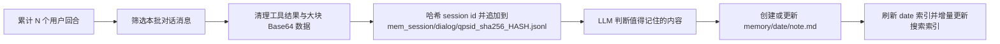
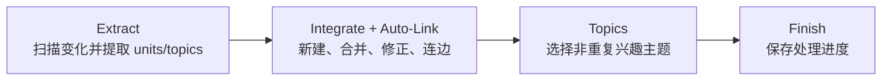
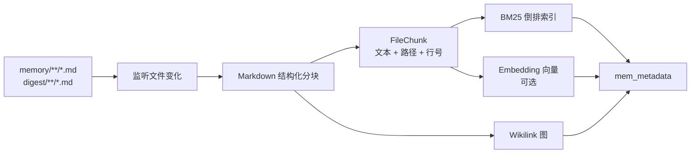

# 长期记忆

NousAIPaw 的长期记忆由 [ReMe](https://github.com/agentscope-ai/ReMe) 驱动。它不是把历史对话全部塞回上下文，而是让对话与 Daily Paper 精读持续沉淀为**可读、可编辑、可检索、相互链接的 Markdown 记忆**，逐步长成一个由用户和 Agent 共同维护的自进化个人知识库。

默认的 `remelight` 后端会在 QwenPaw 进程内嵌入 ReMe，并复用当前 Agent 的模型完成记忆抽取和整理。整个系统沿着“捕获、沉淀、检索、发现”的闭环运行：


对话和外部资源先成为可追溯的每日记忆，再由 Auto-Dream 整合进 `digest/`；索引与搜索只按需取回相关片段，而不是重新装载全部历史。

这套框架由四项核心能力组成：

| 能力               | 作用                                                                                    |
| ------------------ | --------------------------------------------------------------------------------------- |
| **Memory as File** | 以带 frontmatter 和 `[[wikilink]]` 的 Markdown 保存记忆；文件是用户可直接管理的事实来源 |
| **Auto-Memory**    | 从对话中提取值得长期保留的事实、偏好、决策和进展，写入当天的每日记忆                    |
| **Daily Paper**    | 筛选论文、保存 PDF，并把三篇精读和一份每日简报写入每日记忆                              |
| **Auto-Dream**     | 从近期每日记忆中提炼稳定知识，合并或修正长期节点，并通过 Auto-Link 建立关系             |
| **Memory Search**  | 用 BM25 与可选的向量检索召回相关片段，经 RRF 融合后再沿 Wikilink 展开上下文             |

其中 Auto-Memory 是构建个人知识库的前提：先把对话变成可靠素材；Auto-Dream 是知识库持续进化的关键：再把分散素材整合为稳定、互联的长期知识。

这些能力都可以在控制台的长期记忆页面中统一查看和配置：


页面把记忆捕获、定时整理、Daily Paper、搜索与维护状态集中展示；后文会分别说明每个区域对应的运行机制。

---

## Memory as File：记忆就是文件

ReMe 遵循 **Memory as File, File as Memory**：

- 对用户而言，记忆是工作区里的普通文件，可以直接阅读、修改、移动、删除、备份和迁移。
- 对 Agent 而言，每个 Markdown 文件又是一个可分块、可索引、可链接、可持续演化的记忆节点。
- 检索索引、图谱和缓存只是可以从源文件重建的派生状态；真正的记忆源数据仍由用户掌控。

下图把这种关系浓缩为一个可读、可编辑、可追溯且相互连接的 Markdown 网络：


文件正文承载知识，frontmatter 提供概要，Wikilink 则把长期节点与其工作流和每日证据连接起来。

### 文件结构

默认情况下，每个 Agent 的工作区位于 `~/.qwenpaw/workspaces/{agent_id}/`，长期记忆使用以下结构：

```text
{工作区}/
├── memory/                              # 每日记忆：对话事实与论文精读
│   ├── 2026-08-06.md                    # 当日索引页
│   └── 2026-08-06/
│       ├── project-plan.md              # Auto-Memory 创建或更新的记忆卡片
│       ├── paper-reading.md             # Daily Paper 生成的论文精读
│       └── interests.yaml               # Auto-Dream 生成的兴趣主题
├── mem_session/
│   └── dialog/
│       └── qpsid_sha256_<64-hex>.jsonl  # Auto-Memory 的哈希来源对话
├── digest/                              # 长期个人知识库
│   ├── personal/                        # 用户、团队、项目事实与偏好
│   ├── procedure/                       # 流程、runbook、可复用经验
│   └── wiki/                            # 概念、原则、观察与决策先例
├── resource/                            # 知识工作流产生的原始资源
│   └── papers/
│       └── <arxiv_id>.pdf               # Daily Paper 下载的 PDF
└── mem_metadata/                        # 索引、图谱、catalog 与缓存等派生状态
```

四类用户可见目录各自承担不同职责：

| 目录                         | 内容                                       | 是否直接参与 QwenPaw 记忆检索 |
| ---------------------------- | ------------------------------------------ | ----------------------------- |
| `memory/YYYY-MM-DD/*.md`     | 当天事实、对话摘要、决策、进度和论文精读   | 是                            |
| `mem_session/dialog/*.jsonl` | 经过清理的来源对话，用于追溯和后续抽取     | 否                            |
| `digest/`                    | Auto-Dream 整合后的长期个人知识库          | 是                            |
| `resource/`                  | Daily Paper 和未来知识工作流产生的原始资源 | 不直接检索                    |

> QwenPaw 的嵌入式 ReMe 只索引 `memory/` 和 `digest/` 下的 `.md` 文件。原始对话由上下文系统负责查询；Daily Paper 会把可检索的 Markdown 精读写入 `memory/`，而 `resource/` 下的任意文件不会被监听。

### Markdown、Frontmatter 与 Wikilink

一条记忆通常由 YAML frontmatter、正文和 Wikilink 组成：

```markdown
---
name: 用户偏好的发布流程
description: 用户希望先在测试环境验证，再安排生产发布。
source_conversation: "[[mem_session/dialog/qpsid_sha256_<64-hex>.jsonl]]"
---

# 发布偏好

任何生产发布都应先执行 [[digest/procedure/staging-verification.md]]。

## Sources

- [[memory/2026-08-06/release-discussion.md]]
```

Frontmatter 提供节点级摘要与来源元数据；正文保存事实、条件和解释；`[[...]]` 使用工作区相对路径建立文件关系。搜索命中文件后，ReMe 可以从图索引中展开它的入链和出链，让 Agent 同时看到相关长期节点与来源。

---

## Auto-Memory：把对话变成每日记忆

Auto-Memory 是个人知识库的入口。它不会保存聊天流水账，而是提取以后仍可能有用的信息，例如：

- 稳定偏好和长期约定；
- 项目背景、关键事实和限制条件；
- 已确认的决策及其原因；
- 当前进展、阻塞项和下一步；
- 可复用的命令、流程和排查经验。

### 工作原理



QwenPaw 默认每累计 5 个用户回合触发一次。调用 ReMe 前，QwenPaw 会把 session ID 的原始 UTF-8
字节转换为 `qpsid_sha256_<64-hex>`，使文件名长度固定，并避免大小写不敏感或 Unicode 规范化文件系统上的冲突。
ReMe 按这个哈希标识保存来源对话，再查找当天属于该哈希会话的已有记忆卡片；已有则更新，否则最多创建一条新卡片。
自动搜索注入的旧记忆会在抽取前移除，避免把“召回内容”误写成用户刚刚提供的新事实。

该哈希是单向映射，旧版未哈希的 dialog 文件不会迁移。升级后，已有会话会开始写入新的哈希 dialog；
此前已抽取的 Markdown 记忆仍可继续使用。

当上下文实际发生淘汰或折叠时，即使尚未达到正常触发间隔，待保存回合也会进入同一条 Auto-Memory 流程。已搜索回合与待处理回合的状态会跨 middleware 重建和会话恢复保留。自动召回结果只临时注入当前用户回合的模型输入，不会写入正式会话历史或持久化历史。

### 配置

配置位于 `agent.json` 的 `running.reme_light_memory_config`：

```json
{
  "running": {
    "memory_manager_backend": "remelight",
    "reme_light_memory_config": {
      "auto_memory_interval": 5,
      "auto_memory_inbox_push_enabled": true
    }
  }
}
```

| 配置项                           | 默认值 | 说明                                                       |
| -------------------------------- | ------ | ---------------------------------------------------------- |
| `auto_memory_interval`           | `5`    | 每累计 N 个用户回合触发；`null` 或 `<= 0` 表示关闭周期触发 |
| `auto_memory_inbox_push_enabled` | `true` | Auto-Memory 实际修改记忆后，是否把任务结果推送到 Inbox     |

间隔设得越小，记忆更新越及时，但模型调用、Token 消耗和后台任务负担也越高。

### Inbox

开启 `auto_memory_inbox_push_enabled` 后，Auto-Memory 的执行结果会进入 QwenPaw Inbox。若本次判断没有值得新增或更新的内容，ReMe 会标记 `modified=false`，QwenPaw 不会为这次空变更生成 Inbox 事件。

发生实际变更时，Inbox 会给出处理状态、更新文件和提取结果，方便快速确认这次自动记忆做了什么：


Inbox 只是通知入口；可继续复用和编辑的记忆仍以工作区中的 Markdown 文件为准。

### 示例

假设用户在一个 QwenPaw 会话中说：

```text
以后所有生产发布都先跑 staging 验证；发布说明用中文，列出风险和回滚步骤。
```

达到触发间隔后，Auto-Memory 会保留来源对话，并生成或更新类似文件：

```text
mem_session/dialog/qpsid_sha256_<64-hex>.jsonl
memory/2026-08-06/release-discussion.md
```

```markdown
---
name: 生产发布约定
description: 生产发布前先验证 staging，中文发布说明需包含风险和回滚步骤。
source_conversation: "[[mem_session/dialog/qpsid_sha256_<64-hex>.jsonl]]"
---

- 生产发布前必须先完成 staging 验证。
- 发布说明使用中文，并列出风险与回滚步骤。
```

这还是“每日素材”；当相同偏好在更多对话中出现，Auto-Dream 会把它沉淀进稳定的 `digest/` 节点。

---

## Daily Paper

Daily Paper 会收集 Hugging Face 周榜和月榜，排除昨日榜单以及过去 30 天每日笔记 frontmatter 中已经出现的
arXiv ID，再用加权 RRF 生成最多 20 篇候选池。Memory Agent 必须从候选池中选择三篇互不重复的论文。
ReMe 下载 PDF，每篇最多分析 20 页和 300,000 字符（文件最大 50 MiB），最终生成三篇详细精读和一份每日简报。
PDF 保存到 `resource/papers/`，Markdown 写入 `memory/YYYY-MM-DD/`，进入正常记忆索引，并可通过 QwenPaw Inbox 推送结果。

控制台可以配置 Daily Paper 的调度、主题和镜像来源，并决定任务结束后是否发送通知：


这些选项只控制自动运行方式；生成的 PDF、精读和每日简报仍分别进入前述 `resource/` 与 `memory/` 目录。

如果运行日期已经存在每日简报，正常定时调用会成功跳过。底层 job 支持调用方传入 `force=true` 主动重新生成，
但定时配置表单没有暴露这个开关。

Daily Paper 默认关闭。通过 `daily_paper_cron_enabled` 启用，`daily_paper_cron` 控制调度且默认值为 `"0 9 * * *"`。`daily_paper_use_hf_mirror` 用于选择 Hugging Face 镜像，`daily_paper_topics` 用于设置优先主题。

---

## Auto-Dream：让个人知识库持续进化

Auto-Dream 是从每日记忆到长期知识的整合流程。它默认每天定时运行，扫描近期有变化的每日记忆，提取可长期复用的 memory unit，更新 `digest/`，同时生成可供主动交互使用的兴趣主题。

### 工作原理

QwenPaw 的 Auto-Dream 默认扫描目标日期及其前一天（`scan_days=2`），最多抽取 5 个 memory unit，分四个阶段执行：



1. **Extract**：刷新日期索引，比对 dream catalog，只把新增或修改的每日记忆交给 LLM；抽取 `personal`、`procedure`、`wiki` 三类 unit 和兴趣主题候选。
2. **Integrate + Auto-Link**：对每个 unit 调用 `node_search` 查找可能相同或相关的 digest 节点，再选择 `CREATE`、`CORROBORATE`、`REFINE` 或 `CORRECT`。
3. **Topics**：结合最近 7 天的主题去重，默认最多写入 3 个主题到 `memory/<date>/interests.yaml`。
4. **Finish**：把成功处理的输入写入 dream catalog；失败路径不做 checkpoint，下一次仍可重试。

Auto-Dream 不改写每日记忆正文。`memory/` 保留当时发生的事实与现场，`digest/` 保存跨时间复用的抽象。

### Auto-Link 在哪里发生

Auto-Link 不是独立的定时任务，而是 Auto-Dream 的 **Integrate** 阶段：

- `node_search` 只召回 `digest/` 节点的 `name`、`description` 和路径，用于去重与关系发现；
- 相同抽象会更新已有节点，而不是重复创建；
- digest 节点的 `## Sources` 链接回 `memory/` 中的证据；
- 相关 digest 节点通过正文中的 `[[digest/...]]` 相互连接；
- 更新节点时保留既有来源和 Wikilink，知识图谱因此持续生长。

四种整合动作的含义如下：

| 动作          | 含义                                       |
| ------------- | ------------------------------------------ |
| `CREATE`      | 没有相同抽象，创建新的长期节点             |
| `CORROBORATE` | 新材料再次证明已有记忆，补充来源或强化表述 |
| `REFINE`      | 新材料增加步骤、边界、条件或细节           |
| `CORRECT`     | 新材料修正旧节点中的错误、遗漏或冲突       |

### 配置

```json
{
  "running": {
    "reme_light_memory_config": {
      "dream_cron_enabled": true,
      "dream_cron": "0 23 * * *",
      "auto_dream_inbox_push_enabled": true
    }
  }
}
```

| 配置项                          | 默认值         | 说明                                                           |
| ------------------------------- | -------------- | -------------------------------------------------------------- |
| `dream_cron_enabled`            | `true`         | 是否启用定时 Auto-Dream                                        |
| `dream_cron`                    | `"0 23 * * *"` | 5 段 Cron 表达式；触发后随机延迟 0–60 秒启动，避免任务集中运行 |
| `auto_dream_inbox_push_enabled` | `true`         | 是否把 Auto-Dream 任务结果推送到 Inbox                         |

### Inbox

开启 Inbox 推送后，每次 Auto-Dream 的成功或失败摘要都会形成记忆事件，便于查看扫描、整合和主题生成结果。它只用于通知，不是记忆源数据；真正的长期知识仍保存在 `digest/` Markdown 中。

任务完成后，Inbox 会汇总处理日期、整合动作、更新节点和生成的兴趣主题：


这张摘要适合确认任务结果；需要审查具体结论和证据时，仍应打开对应的 `digest/` 与 `memory/` 文件。

### 示例

假设近两天的每日记忆多次出现“发布前验证 staging”和“发布说明必须带回滚步骤”。Auto-Dream 可能：

1. 通过 `node_search` 找到已有的 `digest/procedure/production-release.md`；
2. 选择 `REFINE`，把中文说明、风险列表和回滚步骤补入该流程；
3. 在 `## Sources` 中加入新的每日记忆链接；
4. 链接相关的 `[[digest/personal/release-communication-preference.md]]`；
5. 在当天 `interests.yaml` 中加入“检查生产发布流程是否覆盖回滚演练”的候选主题。

结果不是又复制一份聊天摘要，而是已有长期知识被证据强化并补全关系。

---

## Memory Index 与 Memory Search

后台 `index_update_loop` 负责让文件持续可检索，`memory_search` 负责在需要时召回最相关的内容。索引是派生状态，可以从 `memory/` 与 `digest/` 的 Markdown 重新构建。

### 索引能力与范围

QwenPaw 启动嵌入式 ReMe 后，后台 `index_update_loop` 会：

- 启动时扫描 `daily_dir`（默认 `memory`）和 `digest_dir`（默认 `digest`）；
- 运行期间监听这两个目录下新增、修改和删除的 `.md` 文件；
- 按 Markdown 标题与内容块进行语义分块，保留文件路径和行号；
- 为每个 chunk 更新 BM25 索引，并在启用 Embedding 时生成向量；
- 从 Markdown 中解析 Wikilink，更新文件节点和双向关系图；
- 将派生状态持久化到 `mem_metadata/`。

单个被索引文件上限为 10 MiB。`resource/` 与 `mem_session/` 不在这一索引监听范围内。

### BM25 + Vector 混合索引如何构建



BM25 把每个 chunk 当作一篇文档，记录 token、词频和倒排表，适合函数名、错误码、专有名词等精确命中。启用 Embedding 后，同一 chunk 还会生成向量，用于召回措辞不同但语义相近的内容。

Embedding 的支持后端、启用条件、字段含义、缓存和排查方法请参阅独立文档：[Embedding 向量模型](./embedding)。未配置 Embedding 时，BM25 和 Wikilink 展开仍可正常工作。

### BM25 + Vector 如何进行混合搜索

`memory_search(query, max_results, min_score)` 会调用 ReMe 的 `search` job：


查询会同时利用精确关键词和语义相似度，经 RRF 融合得到相关片段；结果还会提供路径、行号和 Wikilink 邻居，让 Agent 只在确有需要时继续展开证据。

当两路都有结果时，默认使用加权 Reciprocal Rank Fusion（RRF）：

```text
score = 0.7 / (60 + vector_rank)
      + 0.3 / (60 + keyword_rank)
```

RRF 比较的是各自结果列表中的排名，不直接比较数值尺度完全不同的余弦相似度和 BM25 分数。一个 chunk 同时被两路命中时会累加两份贡献；只被一路命中时仍可进入最终结果。若 Embedding 未启用或向量分支没有结果，则直接使用 BM25 排名。

完成融合后，ReMe 会按命中文件从图索引中展开最多 10 条出链和 10 条入链。这样结果既包含最相关的正文片段，也能带出其来源、相关流程和相邻知识节点。

> `min_score` 默认是 `0`。正常使用建议保持默认值，因为单路检索的原始分数与混合检索的 RRF 分数量纲不同，盲目提高阈值可能隐藏有效结果。

### 手动搜索与 Auto-Memory-Search

Agent 可以在判断需要历史信息时主动调用 `memory_search`。如果希望每个普通用户请求都先自动召回记忆，可启用 Auto-Memory-Search：

```json
{
  "running": {
    "reme_light_memory_config": {
      "auto_memory_search_config": {
        "enabled": true,
        "max_results": 2
      }
    }
  }
}
```

启用后，QwenPaw 会在模型处理当前用户请求前，用这条请求构造查询并执行同一个 ReMe `search` job。结果以一组已完成的 `memory_search` 工具交互注入当前 live context，供本轮后续模型调用使用。自动化来源的请求不会触发；注入结果也不会被写回会话历史或 Auto-Memory，避免记忆自我复制。

| 配置项        | 默认值  | 说明                               |
| ------------- | ------- | ---------------------------------- |
| `enabled`     | `false` | 是否为每个普通用户请求自动搜索记忆 |
| `max_results` | `2`     | 每次自动搜索最多注入的结果数       |

### 搜索示例

已有记忆：

```text
memory/2026-08-06/release-discussion.md
digest/procedure/production-release.md
```

用户问“我们上线前要做哪些检查？”时，`memory_search` 可以同时利用：

- **Vector**：把“上线前检查”与“生产发布 staging 验证”按语义匹配；
- **BM25**：精确命中 `staging`、`rollback` 等关键词；
- **Wikilink**：从每日讨论展开到长期发布流程与相关偏好。

返回结果形态类似：

```text
========== digest/procedure/production-release.md:1-18 [score=0.0162 vector=0.84 keyword=3.71] ==========
...生产发布前先完成 staging 验证，并准备风险清单和回滚步骤...
  outlinks (1):
    -> digest/personal/release-communication-preference.md
  inlinks (1):
    <- memory/2026-08-06/release-discussion.md
```

Agent 可根据返回的路径和行号继续精确读取原文件。

### ReMeLight 完整配置

主要用户配置字段都位于 `running.reme_light_memory_config`：

| 配置项                           | 默认值           | 说明                                                   |
| -------------------------------- | ---------------- | ------------------------------------------------------ |
| `metadata_dir`                   | `"mem_metadata"` | 索引、图谱、catalog 与缓存目录                         |
| `session_dir`                    | `"mem_session"`  | Auto-Memory 来源对话目录                               |
| `mem_session_dir`                | `"mem_agent"`    | ReMe 内部 memory-agent 会话目录                        |
| `resource_dir`                   | `"resource"`     | Daily Paper 与未来知识工作流使用的原始资源目录         |
| `daily_dir`                      | `"memory"`       | 每日记忆目录                                           |
| `digest_dir`                     | `"digest"`       | 长期知识库目录                                         |
| `auto_memory_inbox_push_enabled` | `true`           | 是否把 Auto-Memory 结果推送到 Inbox                    |
| `auto_dream_inbox_push_enabled`  | `true`           | 是否把 Auto-Dream 结果推送到 Inbox                     |
| `daily_paper_inbox_push_enabled` | `true`           | 是否把 Daily Paper 结果推送到 Inbox                    |
| `auto_memory_interval`           | `5`              | Auto-Memory 的用户回合间隔                             |
| `dream_cron_enabled`             | `true`           | 是否启用定时 Auto-Dream                                |
| `dream_cron`                     | `"0 23 * * *"`   | Auto-Dream 的 5 段 Cron 表达式                         |
| `daily_paper_cron_enabled`       | `false`          | 是否启用定时 Daily Paper                               |
| `daily_paper_cron`               | `"0 9 * * *"`    | Daily Paper 的 5 段 Cron 表达式                        |
| `daily_paper_use_hf_mirror`      | `false`          | 是否通过 Hugging Face 镜像获取论文信息                 |
| `daily_paper_topics`             | `""`             | 筛选论文时优先考虑的主题                               |
| `memory_search_enabled`          | `true`           | 是否向 Agent 提供 `memory_search` 工具                 |
| `auto_memory_search_config`      | 见上文           | 自动记忆搜索配置                                       |
| `embedding_model_config`         | 默认未启用       | 可选向量模型配置，见 [Embedding 向量模型](./embedding) |
| `needs_reindex`                  | `false`          | 运行时维护的待重建向量索引标记                         |

旧字段 `inbox_push_enabled` 仅作为迁移输入：它会初始化三个尚未显式配置的独立 Inbox 开关，
并在配置校验后的序列化结果中被排除。

需要检查后台任务、等待队列或各索引组件的资源占用时，可以从长期记忆页面打开 ReMe 运行状态：


这里显示的是运行与派生组件状态，不是记忆正文；异常排查完成后，源数据仍应以工作区中的 Markdown 为准。

### 重建索引

索引通常由后台增量维护。当 Console 提示 Embedding 向量空间变化需要重建、索引损坏或搜索结果明显异常时，
在 Agent 长期记忆设置中选择**重建记忆索引**，或调用：

```http
POST /api/agents/{agentId}/memory/reindex
```

重建会清空并从现有 `memory/`、`digest/` Markdown 重新生成派生索引，期间 CPU 和内存占用可能升高。
同一 Agent 同时只能运行一个重建任务，重建期间修改 Embedding 会被拒绝。只有持久化配置和当前运行配置仍与
本次重建目标的向量空间指纹一致时，成功重建才会清除 `needs_reindex`。`rebuild_memory_index_on_start` 已不再支持。

因此，控制台会在真正清理派生索引前要求再次确认：


只有确实需要修复索引或切换向量空间时才执行该操作；普通的 Markdown 增删改由后台增量维护即可。

---

## 其他 Memory Backend

NousAIPaw 的记忆系统采用可插拔的 Backend 架构。除了默认的 ReMeLight（本地文件存储）外，还支持通过 `memory_manager_backend` 切换到其他后端。

### ADBPG（AnalyticDB for PostgreSQL）

基于云端向量数据库的长期记忆后端，适合需要跨设备共享、大规模语义检索的场景。NousAIPaw 通过 ADBPG 记忆服务的 REST API 接入，无需安装额外数据库驱动。

**核心特点：**

- **跨会话持久化** — 记忆存储在云端数据库，重启后不丢失，支持多设备共享
- **服务端事实抽取** — 由 ADBPG 记忆服务完成事实提取，客户端无额外开销
- **REST API 接入** — 通过 HTTP API 调用 ADBPG 记忆服务
- **优雅降级** — ADBPG 不可达时 Agent 正常运行，仅长期记忆功能暂时禁用

**配置方式：**

进入 Agent 配置页面的「运行配置」标签，找到「长期记忆管理后端」下拉框，选择 `adbpg`，并在「ADBPG 长期记忆」Tab 中填写 `REST Base URL` 与 `REST API Key`。


> ⚠️ 切换后端不支持热更新，保存后需要重启 NousAIPaw 才能生效（页面也会以黄色横幅提醒）。

> 迁移提示：ADBPG SQL 直连模式已移除。旧配置中的 `api_mode: "sql"`、
> `host`、`port`、`user`、`password`、`dbname`、LLM 和 Embedding 相关字段
> 会被忽略；请改为配置 `rest_base_url` 和 `rest_api_key`，保存后重启
> NousAIPaw。

| 配置项                      | 说明                                                                    | 默认值                                |
| --------------------------- | ----------------------------------------------------------------------- | ------------------------------------- |
| `rest_base_url`             | ADBPG 记忆服务的 REST API 地址                                          | `""`                                  |
| `rest_api_key`              | REST API 的访问密钥                                                     | `""`                                  |
| `memory_isolation`          | 记忆隔离模式，`true` 为每个 Agent 独立，`false` 为共享                  | `true`                                |
| `search_timeout`            | 记忆搜索超时时间（秒）                                                  | `10.0`                                |
| `auto_memory_search_config` | 自动记忆搜索配置，结构与 ReMe Light 的 `auto_memory_search_config` 一致 | `{"enabled": true, "max_results": 3}` |

**配置示例：**

完整配置可写入 `agent.json` 的 `running.adbpg_memory_config` 字段：

```json
{
  "running": {
    "memory_manager_backend": "adbpg",
    "adbpg_memory_config": {
      "rest_base_url": "https://your-adbpg-memory-api.example.com",
      "rest_api_key": "your-rest-api-key",
      "memory_isolation": true,
      "search_timeout": 10.0,
      "auto_memory_search_config": {
        "enabled": true,
        "max_results": 3
      }
    }
  }
}
```

> 💡 通过 Console「运行配置」页面填写时，框架会自动将这些字段写入 `agent.json`，无需手动编辑文件。

---

## 相关页面

- [智能体记忆进化](./memory-evolving-and-proactive) — Auto-Memory、Auto-Dream、Auto-Memory-Search 与 Proactive 工作流
- [Embedding 向量模型](./embedding) — 向量模型能力、后端、配置与排查
- [控制台](./console) — 在控制台管理记忆与配置
- [配置与工作目录](./config) — 工作目录与 Agent 配置
